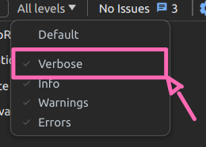

Boot que controla o debugging da aplicação implementando a lib [debug](https://www.npmjs.com/package/debug).

Componentes com debug:
```md
- QasFormView
- QasListView
- QasSingleView
- QasFilters
- QasNestedField
```

:::warning
É necessário habilitar a opção "verbose" em navegadores `chromium based`.


:::

:::tip
A configuração debug fica registrada no localStorage, permitindo que seja ajustada diretamente por lá, economizando a necessidade de seta um novo valor para a env `DEBUG` a cada vez. Contudo, é importante notar que, devido ao armazenamento no localStorage, se a intenção for alterar o ambiente através do terminal, é necessário limpar manualmente o localStorage. Caso contrário, as mudanças não serão refletidas na aplicação, pois ela mantém uma cópia em cache dessa configuração.
:::

:::info
Foi mantido o uso da env `DEBUGGING` pois ela é adicionada automaticamente em localhost e já existe a configuração dela no ambientes de dev na vercel.
:::

Para ter um controle mais individual utilize a env `DEBUG`, exemplo habilitando debug somente para o componente `QasFilters`.

```js
DEBUG=asteroid-ui:qas-filters
```

Habilitando para mais de 1 componente:

```js
DEBUG=asteroid-ui:qas-filters,asteroid-ui:qas-form-view
```

Habilitando para todos
```js
DEBUGGING=true (preferencial) // ou

DEBUG=asteroid-*:*
```
